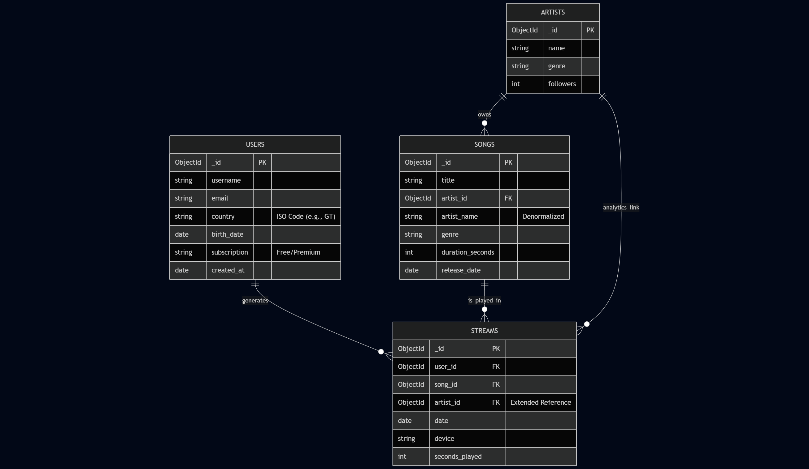
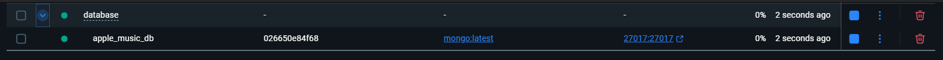
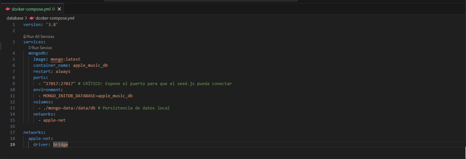
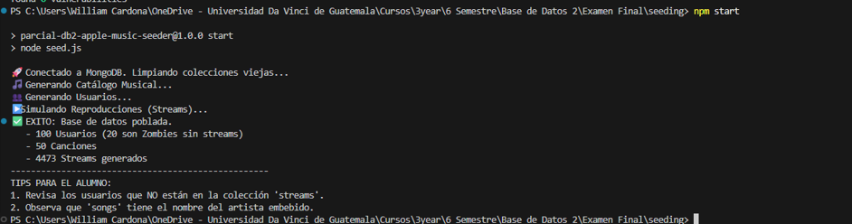
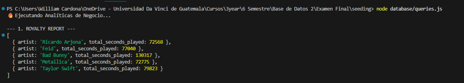
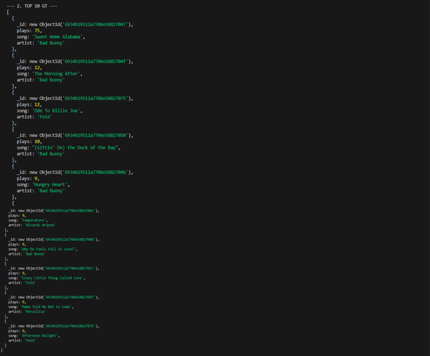
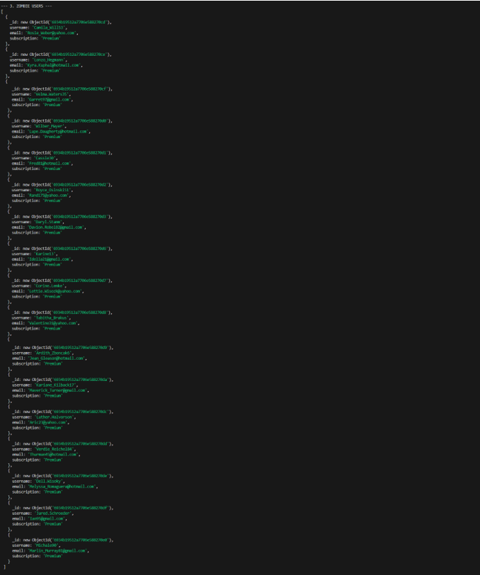
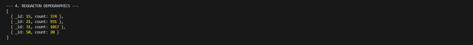
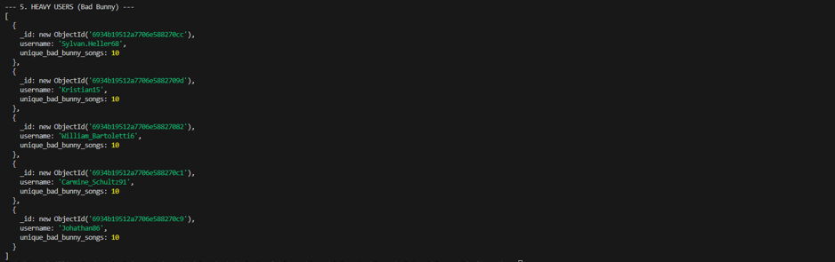
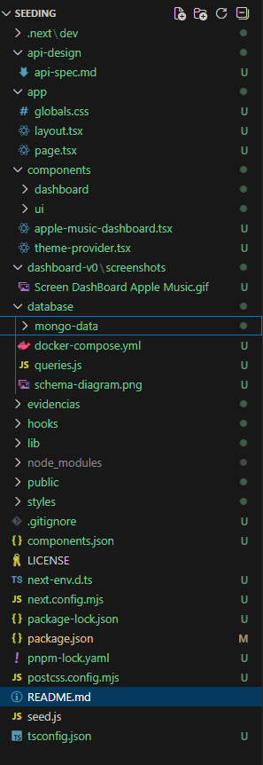

# 🎵 Apple Music NoSQL Analytics Engine (PoC)

> **Examen Final: Bases de Datos 2**
> **Arquitectura de Datos para Migración a MongoDB**
>
> **Autor:** William Cardona
> **Rol:** Líder de Infraestructura / Arquitecto de Datos
> **Fecha:** Diciembre 2025

---

## Resumen del Proyecto

Este proyecto es una Prueba de Concepto (PoC) solicitada por la directiva de Apple Music para migrar el motor de analíticas actual (SQL) a una arquitectura **NoSQL basada en MongoDB**.

El objetivo es soportar la ingesta masiva de **millones de streams por minuto** y proveer métricas en tiempo real a los departamentos de Finanzas (Regalías) y Marketing (Churn Risk y Demografía).

### Stack Tecnológico
* **Base de Datos:** MongoDB v8.2.0 (Contenerizada)
* **Infraestructura:** Docker & Docker Compose
* **Lenguaje de Scripting:** Node.js v24.11.0
* **Generación de Datos:** Faker.js (Simulación de datasets masivos)

---

## Arquitectura de Datos (Schema Design)

Para cumplir con los requisitos de alto rendimiento de escritura (High Write Throughput) y lectura analítica, diseñamos un esquema desnormalizado utilizando el **Extended Reference Pattern**.


*(Ver archivo PDF en database/schema-diagram.png)*

### Decisiones de Diseño Críticas:

1.  **Colección `streams` (Optimizada para Regalías):**
    * **Estrategia:** Patrón de Referencia Extendida.
    * **Implementación:** Guardamos el `artist_id` dentro del documento de `streams`, aunque este dato pertenezca lógicamente a la canción.
    * **Justificación:** Esto permite calcular el "Reporte de Regalías" agrupando millones de registros directamente en la colección de streams sin realizar costosos `$lookup` (JOINs) hacia las colecciones de canciones o artistas. Reduce la carga de CPU y latencia en reportes financieros.

2.  **Colección `songs` (Lectura Rápida):**
    * Incluye `artist_name` y `genre` embebidos para evitar JOINs al renderizar listas de reproducción o Top Charts en el cliente.

3.  **Manejo de Tiempos:**
    * Uso de tipos `ISODate` nativos para permitir agregaciones de ventana de tiempo (últimos 7 días, 30 días) y cálculos de edad eficientes.

---

## Instalación y Despliegue

Sigue estos pasos para levantar el entorno completo.

### 1. Requisitos Previos
* Docker Desktop instalado y corriendo.
* Node.js (v16+) y NPM.

### 2. Infraestructura (Docker)
Levantar la base de datos MongoDB con persistencia de datos:

```bash
cd database
docker-compose up -d

```
*(Esto iniciará el servicio ``apple_music_db`` en el puerto ``27017``.)*






### 3. Instalación de Dependencias
Instalar librerías para el script de generación de datos:

```bash
# Desde la raíz del proyecto
npm install

```


# 4. Data Seeding (Generación de Datos)

Poblar la base de datos con usuarios, canciones y miles de streams simulados:
```bash
npm start
```

Salida esperada: ``✅ EXITO: Base de datos poblada.``



# Ejecución de Analíticas (Business Queries)

Para demostrar la capacidad de la arquitectura, ejecutamos el motor de agregación que responde a las 5 preguntas de negocio críticas:

```bash
node database/queries.js
```

**Las 5 Consultas Implementadas:**

1. 💰 Reporte de Regalías: Suma total de segundos reproducidos por artista (Último mes).



2. **🇬🇹** Top 10 Regional: Canciones más escuchadas en Guatemala (Últimos 7 días).



3. 🧟 Detección de Zombies: Usuarios Premium sin actividad en 30 días (Riesgo de Churn).



4. 📉 Demografía por Género: Distribución de edades de oyentes de "Reggaeton".



5. 🏆 Heavy Users: Usuarios con mayor unicidad de canciones escuchadas de "Bad Bunny".




# API Specification

El Dashboard administrativo consume la data a través de una API REST definida en el siguiente contrato.

## 1. Get Artist Royalties
**Endpoint:** `GET /api/analytics/royalties`
**Description:** Retorna el tiempo total reproducido por artista en los últimos 30 días.
**Response:**
```json
[
  { "artist": "Bad Bunny", "total_seconds_played": 45000 },
  { "artist": "Taylor Swift", "total_seconds_played": 32000 }
]

```

## 2. Top Songs by Region
**Endpoint:** `GET /api/charts/top-songs`
**Query Params:** ?region=GT&days=7
**Response:**
```json

[
  { "song": "Luna", "artist": "Feid", "plays": 150 },
  { "song": "Monaco", "artist": "Bad Bunny", "plays": 120 }
]

```

## 3. Zombie Users Risk
**Endpoint:** GET /api/users/churn-risk
**Response:**
```json
[
  { "username": "usuario1", "email": "u1@mail.com", "subscription": "Premium" }
]
```

## 4. Demographics by Genre
**Endpoint:** `GET /api/analytics/demographics`
**Query Params:** ?genre=Reggaeton
**Response:**
```json
[
  { "_id": 15, "range": "15-20", "count": 45 },
  { "_id": 21, "range": "21-30", "count": 120 }
]
```

## 5. Heavy Listeners
**Endpoint:** `GET /api/users/heavy-listeners`
**Query Params:** ?artist=Bad Bunny
**Response:**
```json
[
  { "username": "fan_numero1", "unique_artist_songs": 18 },
  { "username": "music_lover", "unique_artist_songs": 15 }
]
```

# Estructura del Proyecto



# Video Demo

URL: 